# BREATHE - Better REspiration And Tracking for HEalthy Sleep
BREATHE is a medical informatics project designed to support the monitoring and management of Obstructive Sleep Apnea (OSA) through a digital platform that integrates physiological data from home monitoring devices and provides dedicated interfaces for patients, specialists, and system technicians.

The project was developed within the Medical Informatics course at Politecnico di Milano (Academic Year 2024–2025) and focuses on the design and implementation of a healthcare monitoring ecosystem, including a database, system architecture, and graphical user interfaces (GUI). 

The application enables patients to track sleep-related physiological parameters collected at home, while allowing clinicians to monitor data, manage appointments, prescribe exams, and communicate with patients.

## Project Overview 
Obstructive Sleep Apnea is a sleep disorder characterized by repeated interruptions of breathing during sleep due to upper airway obstruction. Early detection and continuous monitoring are essential to avoid long-term complications.

The BREATHE system integrates data from a home monitoring device placed under the mattress (e.g., Withings Sleep Analyzer), which collects parameters such as: sleep stages, respiratory patterns, heart rate, apnea events, snoring and night movements. These data are automatically uploaded to the system and made avalaible through the application interface for analysis and clinical follow-up. The platform is designed to improve patient awareness of sleep disorders and provide clinicians with objective data to support diagnosis and treatment decisions.

## System Architecture 
The BREATHE system is based on several interacting components:
- Graphical User Interfaces (GUI) for the three main actors
- Database Management System (DBMS) for storing patient data and system information
- External monitoring devices for collecting physiological parameters
- Notification system for communication between users
- SS-Middleware, which enables interoperability with the national healthcare system

The system architecture ensures continuous data acquisition from home monitoring devices and provides secure access to medical information.

<p align="center">
  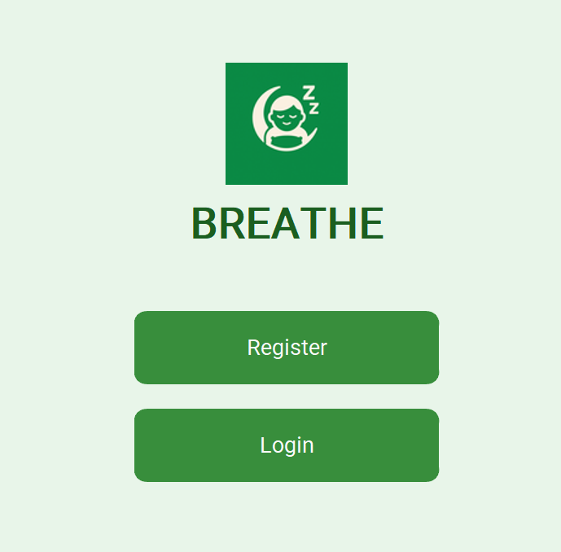
</p>
<p align="center">
  <em>Figure 1 – Home page.</em>
</p>

## User Roles
The application supports three main user roles, each with a dedicated interface and functionalities. 

### Patient / Caregiver 
The patient (or caregiver) is the central actor of the system. Through the application interface, the patient can: 
- Register and log into the system
- Connect a monitoring device via Bluetooth
- View sleep analysis data and physiological parameters
- Fill in clinical questionnaires related to sleep disorders
- Upload notes or additional medical information
- Contact the specialist via chat
- Manage scheduled visits
- Receive notifications and alerts
Sleep data are automatically collected by the external device during the night and synchronized with the application.

<p align="center">
  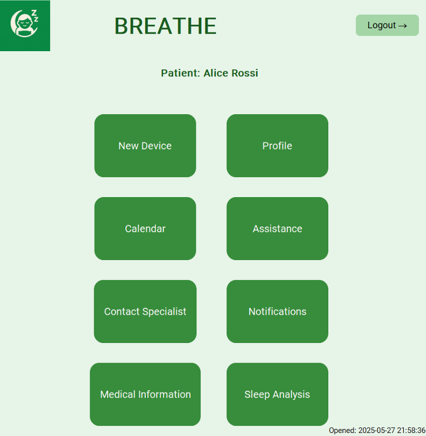
</p>
<p align="center">
  <em>Figure 2 – Patient dashboard showing sleep monitoring data and system navigation.</em>
</p>


### Specialist 
The specialist monitors patient health conditions and manages clinical activities. The specialist interface allows the clinician to:
- Access the list of assigned patients
- Visualize sleep analysis and questionnaire results
- Upload manual clinical measurements (blood pressure, oxygen saturation, weight)
- Create medical prescriptions
- Schedule and manage patient visits
- Communicate with patients through the messaging system
- Access the patient’s Electronic Health Record (EHR)
The system also integrates with healthcare infrastructure through a middleware that enables data exchange with the national healthcare system

<p align="center">
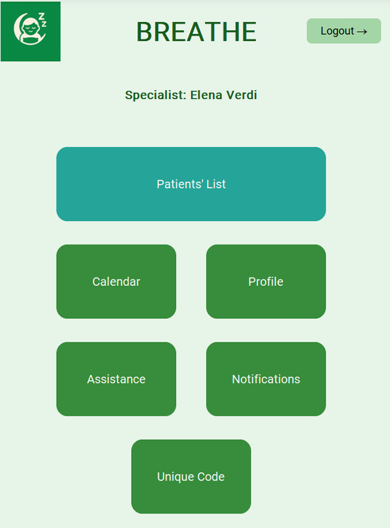
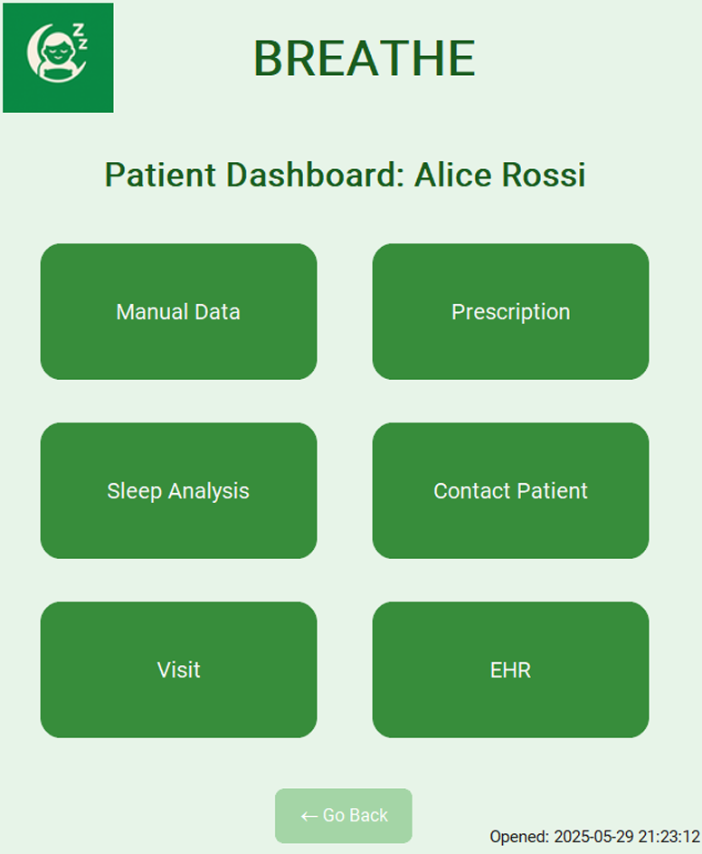
</p>
<p align="center">
<em>Figure 3 – Specialist interfaces of the BREATHE system.</em>
</p>

### Technician
The technician is responsible for system administration and maintenance. Through the technician dashboard, the technician can:
- Approve or reject new user registrations
- Manage support tickets submitted by users
- Monitor system activities
- Perform database backups
- Maintain system integrity and security
This role ensures that the platform operates correctly and that all user profiles are properly verified.

<p align="center">
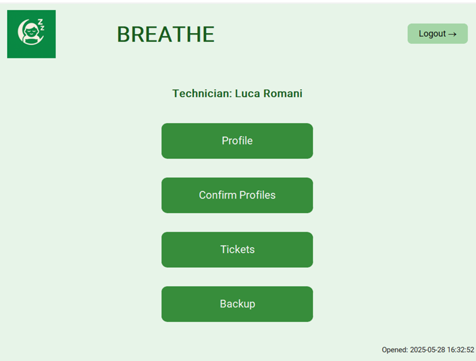
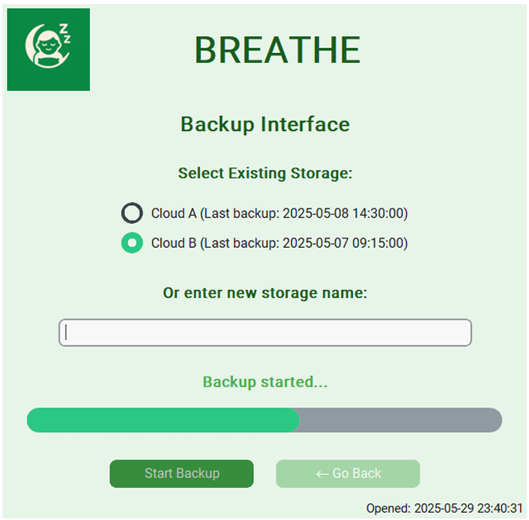
</p>
<p align="center">
<em>Figure 4 – Technician interfaces of the BREATHE system and example a task (backup of the system).</em>
</p>

## Technologies Used 
The system was developed using the following technologies:
- Python – main programming language
- GUI framework (depending on implementation, e.g. Tkinter / PyQt / CustomTkinter)
- Database Management System for storing system data
- Bluetooth communication modules for connecting external devices
- Middleware integration for healthcare data exchange

# Installation 
To run the project locally, first clone the repository:

```bash
git clone https://github.com/mavisari/Breathe.git
cd breathe-project
```

Create a virtual environment:
```bash 
python -m venv venv
```
Activate the virtual environment:
MacOS/Linux
```bash 
source venv/bin/activate
```
Windows 
```bash 
venv\Scripts\activate
```
Install the required dependencies: 
```bash 
pip install -r requirements.txt
```

# Running the Application 
After creating thr database and filled it, to start the application, run: 
```bash 
python SoftwareInteraction.py
```
This will launch the graphical interface where users can select their role and log into the system. Depending on the role selected (Patient, Specialist, Technician), the system loads the corresponding dashboard and functionalities.

# External Device Integration 
The system supports integration with external sleep monitoring devices. Once connected via Bluetooth, the device automatically uploads collected physiological data to the system database. These data include heart rate, respiratory rate, sleep stages, apnea events and night movements. The data are then visualized through graphs and reports in the application interface. 
<p align="center">
  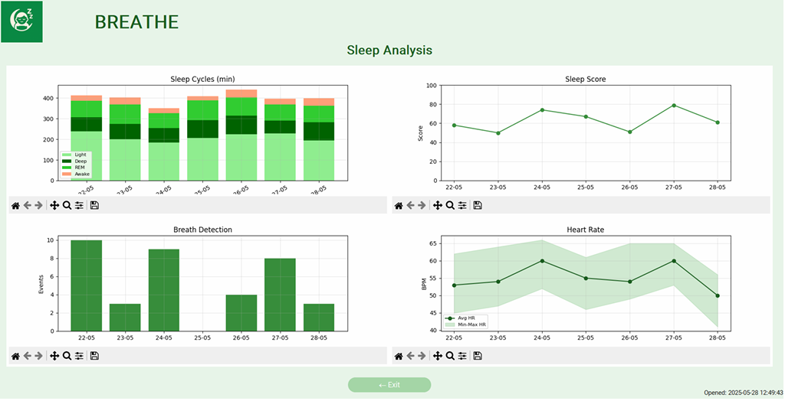
</p>
<p align="center">
  <em>Figure 5 – Sleep Analysis visualization from external device.</em>
</p>

# Main Functionalities 
The BREATHE system provides several key features:
- Remote monitoring of sleep-related parameters
- Patient-specialist communication
- Medical questionnaire management
- Appointment scheduling
- Prescription management
- Integration with healthcare systems
- Administrative system management
These functionalities support continuous monitoring and follow-up of patients affected by sleep disorders.

<p align="center">
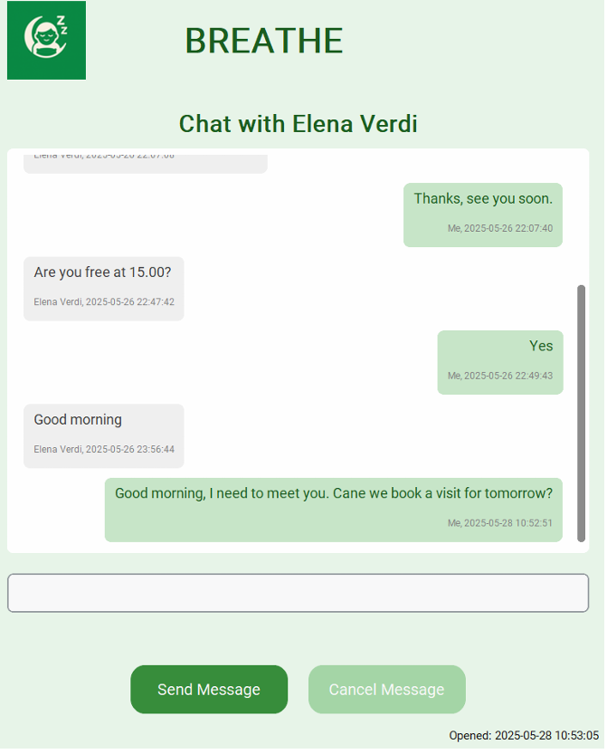
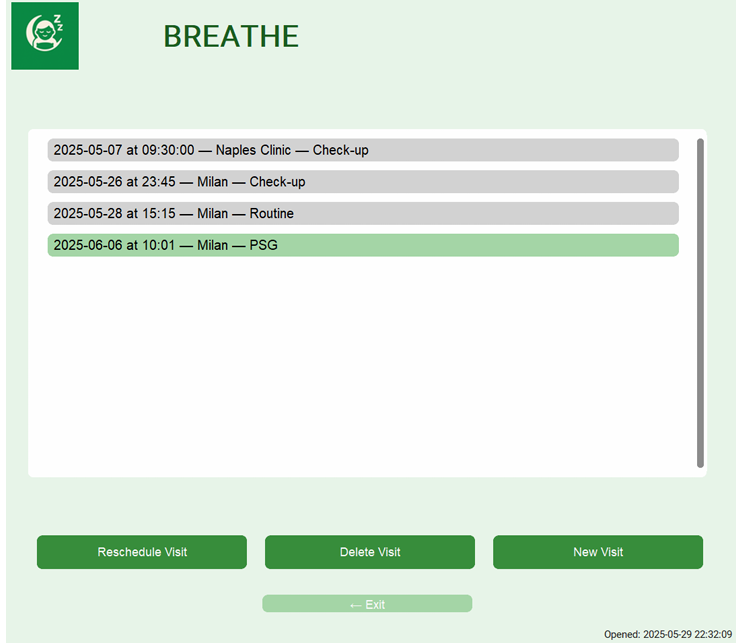
</p>

<p align="center">
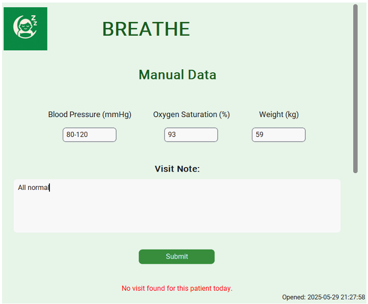
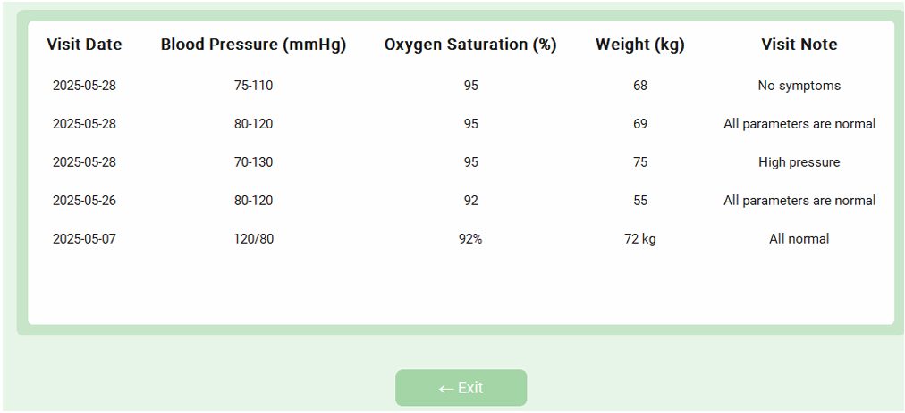
</p>

<p align="center">
  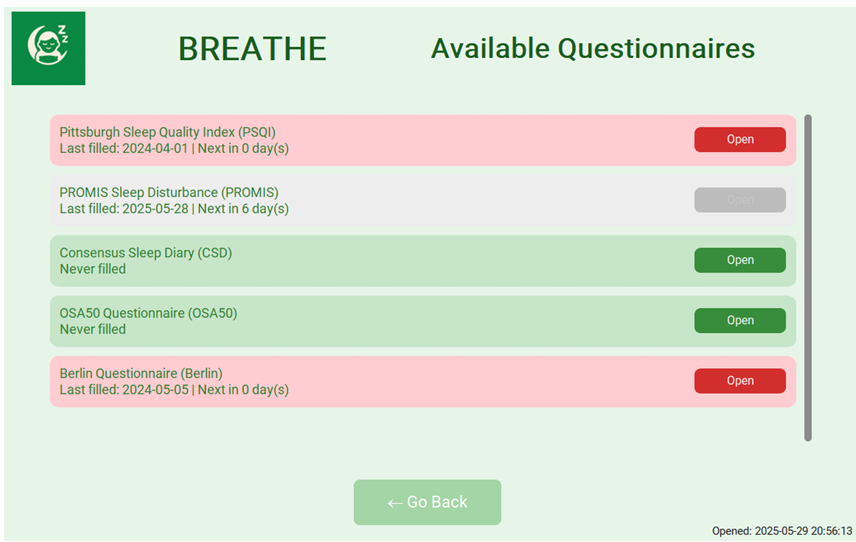
</p>
<p align="center">
<em>Figure 6 – Examples of features in the BREATHE system.</em>
</p>

# Limitation and Future Improvements 
Although the system provides a complete monitoring workflow, some limitations remain. Future developments could include:
- Integration with additional medical devices
- Real-time data visualization
- Mobile application support
- Advanced analytics and AI-based anomaly detection
- Enhanced security and data privacy mechanisms

# Authors
Group 7 - Medical Informatics 
Politecnico di Milano 
Giselda Maria Cucci, Anna Mantelli, Martina Onetti, Maria Vittoria Sari, Chiara Spitoni, Vanessa Volpato 
Academic Year 2024 - 2025
